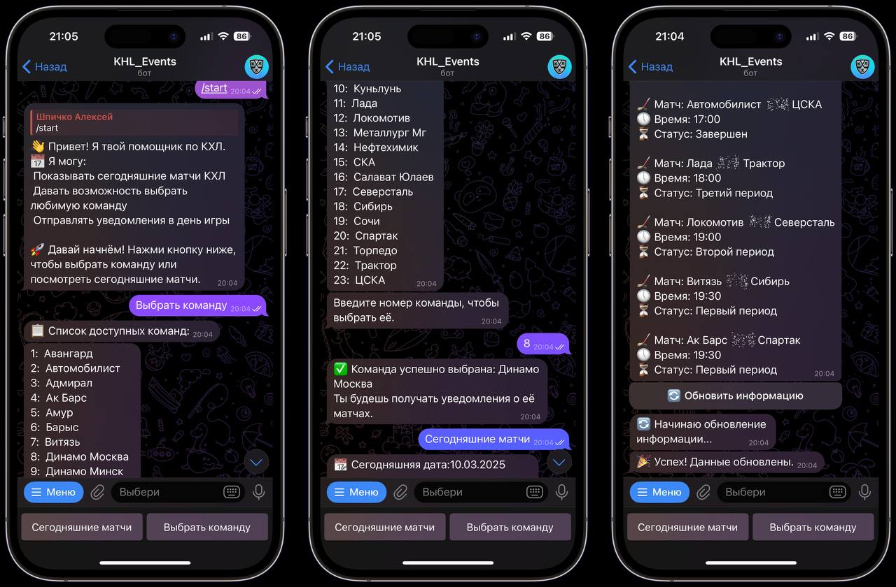

# 🏒 KHL Matches Telegram Bot 🤖

Этот проект представляет собой **телеграм-бота**, который предоставляет информацию о **матчах КХЛ** на текущий день, а также позволяет подписаться на уведомления о матчах **любимой команды**. 📅🎯

## 🛠️ Основной функционал:

- **Парсинг матчей КХЛ**: Бот парсит информацию о матчах с веб-сайта и добавляет ее в **базу данных**. 📊
- **Просмотр матчей**: По запросу пользователя бот может вывести **список матчей** на текущий день. 📋
- **Уведомления о матчах любимой команды**: Подпишитесь на свою любимую команду, и бот будет присылать **уведомления** о матчах этой команды. 🔔⚡

## ⚙️ Стек технологий:

- **Python** — основной язык программирования 🐍
- **PostgreSQL** — база данных для хранения информации о матчах 🗄️
- **FastAPI** — для реализации API 🖥️
- **Alembic** — для миграций базы данных 🛠️
- **Aiogram** — для создания и работы с телеграм-ботом 📲
- **APScheduler** — для планирования задач, например, отправки уведомлений 🕰️
- **Git** — для контроля версий проекта ‍💻
- **Docker** — для контейнеризации приложения 🐳
- **SQLAlchemy** — для работы с базой данных 🔌
- **Pydantic** — для валидации данных ✅
- **BeautifulSoup** — для парсинга информации с сайта 🌐

## 📷 Пример ответа бота:

    

